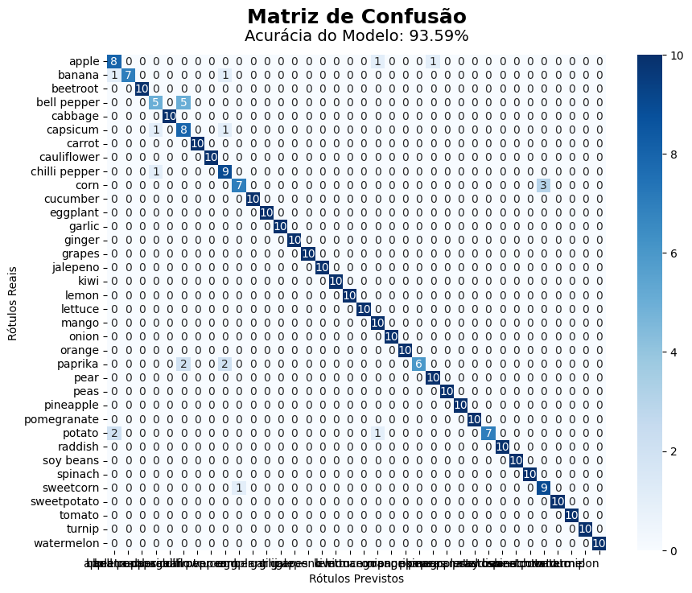

# Reconhecimento de Frutas e Vegetais com CNN (ResNet50)

## Equipe

- Igor Araujo de Mattos

## Descrição Geral do Projeto

Este projeto tem como objetivo realizar a classificação automática de imagens de frutas e vegetais utilizando uma abordagem baseada em Redes Neurais Convolucionais (CNNs), com foco na arquitetura ResNet50. O conjunto de dados utilizado foi coletado do Kaggle e contém 36 classes, divididas entre frutas e vegetais, com imagens organizadas em pastas de treino, validação e teste.

## Repositório do Projeto

🔗 [Fruits-Vegetables-Image-Recognition](https://github.com/igormatt0s/Fruits-Vegetables-Image-Recognition)

## Descrição do(s) Descritor(es) Implementado(s)

**Descritor:** ResNet50 (pré-treinada no ImageNet)  
**Tipo:** Extrator de características baseado em convoluções profundas.  
**Características extraídas:**  
- Padrões visuais espaciais (bordas, texturas, formas e composições complexas)  
- Invariante a translações e pequenas rotações  
- Representações hierárquicas das imagens para uso em classificação multiclasse.

## Bibliotecas Utilizadas

- `TensorFlow` e `Keras` — Construção, treinamento e avaliação do modelo CNN  
- `sklearn` — Métricas e matriz de confusão  
- `Matplotlib` e `Seaborn` — Visualização gráfica dos resultados  
- `NumPy` — Manipulação de arrays  
- `Google Colab` — Ambiente de execução e armazenamento via Google Drive

## Estratégia / Metodologia

1. **Pré-processamento e Augmentation:**  
   - Redimensionamento das imagens para 224x224  
   - Aumento de dados com flips, rotações, zoom e shift  
   - Normalização com `preprocess_input` da ResNet50  

2. **Modelo CNN (ResNet50):**  
   - Camadas congeladas inicialmente (transfer learning)  
   - Fine-tuning das últimas 60 camadas  
   - Camadas densas adicionais com regularização e dropout  

3. **Treinamento:**  
   - Fase inicial com camadas congeladas por 5 épocas  
   - Fase de fine-tuning com taxa de aprendizado menor por mais 10 épocas  
   - Uso de callbacks para checkpoint, redução da taxa de aprendizado, early stopping e logging  

4. **Avaliação:**  
   - Avaliação no conjunto de teste  
   - Geração de matriz de confusão  
   - Métricas por classe: precision, recall, f1-score

## Classificador e Acurácia

- **Classificador:** CNN com arquitetura ResNet50 (transfer learning e fine-tuning)  
- **Acurácia final no conjunto de teste:** **93,59%**  
- **Número de classes:** 36  
- **Total de imagens:**  
  - Treinamento: 3.115  
  - Validação: 351  
  - Teste: 359  

## Resultados Obtidos

- **Matriz de confusão** bem distribuída, demonstrando aprendizado generalizado  

- **Acurácia alta** apesar da diversidade de categorias  
- **Desempenho robusto por classe** com f1-score elevado na maioria das categorias

- **Modelo salvo em formato `.keras` para reuso futuro**

## Instruções de Uso

1. Clone o repositório:
   ```bash
   git clone https://github.com/igormatt0s/Fruits-Vegetables-Image-Recognition.git

## 📌 Citação do Dataset

> Kritik Seth, *Fruits and Vegetables Image Recognition Dataset*, Kaggle 2020.  
> 🔗 [https://www.kaggle.com/kritikseth/fruit-and-vegetable-image-recognition](https://www.kaggle.com/kritikseth/fruit-and-vegetable-image-recognition)
